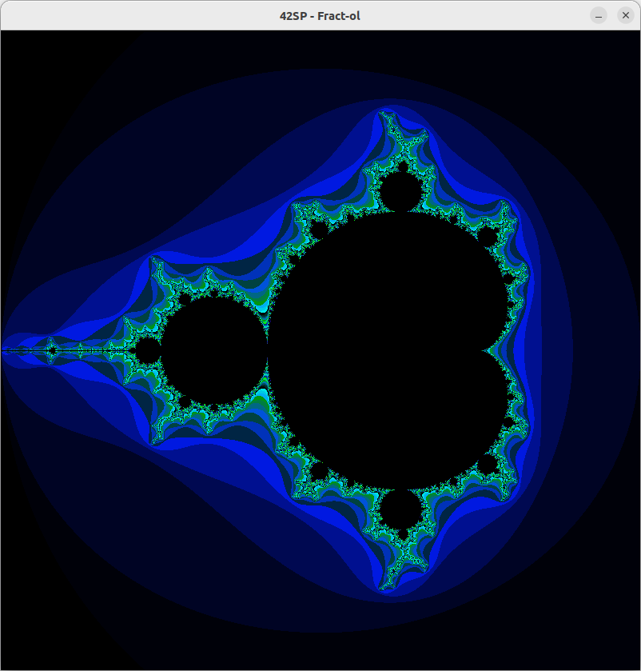
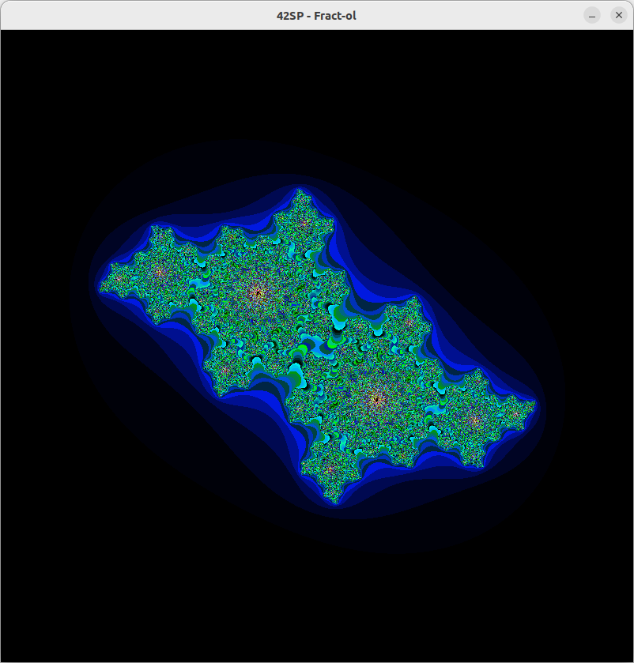
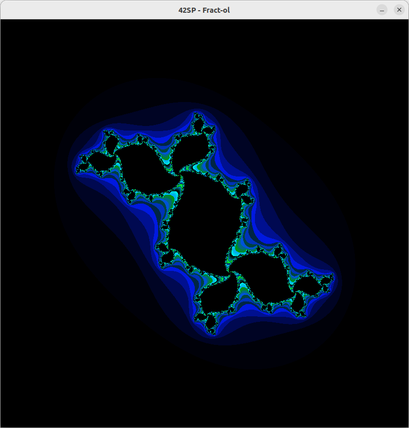
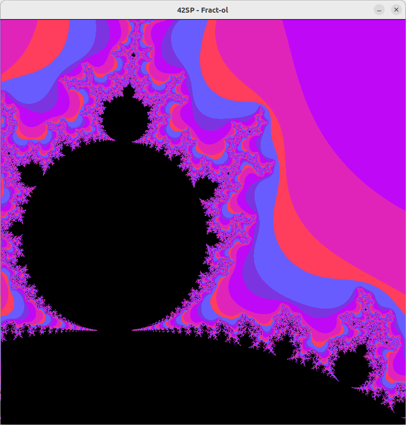
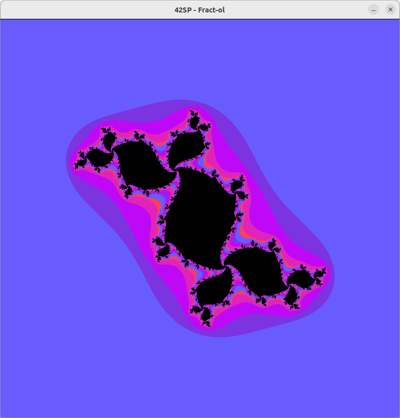

# 42cursus-05-Fract-ol

	

Descubra a programação 2D e o universo psicodélico dos fractais neste projeto, usando minilibX.

Éh, escolhi o Fract-Ol. Será que fiz uma boa escolha!? 🧐

Primeiro ponto nesse projeto é entender a biblioteca que trata de gerar as imagens e janelas. A MiniLibX.

Tem a versão oficial, da **42Paris**, mas pouco documentada - [`42Paris/MiniLibX`](https://github.com/42Paris/minilibx-linux)

E tem essa versão da comunidade **42Amsterdam**, bem documentada e mais atualizada - [`codam_coding-college/MLX42`](https://github.com/codam-coding-college/MLX42)

Segundo ponto, saber o que é um fractal. Pois então, o que é um Fractal?

### Parte Obrigatória

- Plotar um Fractal de Mandelbrot

	

- Plotar um Fractal de Julia (-0.4 | 0.6)

	

- Plotar um Fractal de Julia (-0.08 | 0.72)

	

### Parte Bônus

- Plotar um Fractal de Mandelbrot

	

- Plotar um Fractal de Julia (-0.4 | 0.6)

	

- Plotar um Fractal de Julia (-0.08 | 0.72)

	

### Coisas legais do projeto

Uma funcionalidade muito linda, que apesar de não estar contemplada no plano oficial do projeto, encanta muito por suaaplicabilidade e formas resultantes.

Capturando as coordenadas de referência do ponteiro do mouse e aplicando em tempo real a fórmula de geração do Fractal Julia.

	

